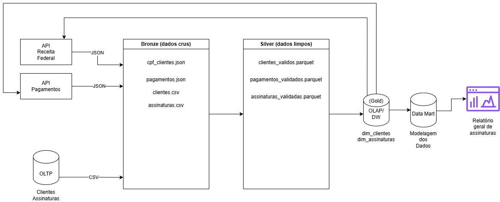

# Medallion Architecture – Data Engineering Study

Este repositório apresenta um **projeto de estudo com foco exclusivo em arquitetura de Engenharia de Dados**, utilizando o padrão **Medallion Architecture (Bronze / Silver / Gold)**.

O objetivo é **entender, estruturar e comunicar uma arquitetura de dados**, simulando um cenário real de integração, tratamento e disponibilização de dados para análise.

---

## 🏗️ Arquitetura

O projeto segue a Arquitetura Medalhão, dividindo o fluxo de dados em três camadas:

### 🥉 Bronze
Camada de ingestão responsável por armazenar os dados crus, exatamente como são recebidos das fontes (OLTP, arquivos CSV e APIs externas), sem aplicação de regras de negócio.

### 🥈 Silver
Camada onde são centralizadas as regras de tratamento e qualidade dos dados, incluindo validações, padronizações e enriquecimentos, garantindo consistência antes do uso analítico.

### 🥇 Gold
Camada voltada ao consumo analítico, onde os dados tratados são modelados e disponibilizados em um **Data Warehouse / Data Mart**, facilitando consultas e relatórios.

---

## 🔍 Por que tratar os dados antes do Data Warehouse?

Realizar o tratamento dos dados antes do DW garante:
- Dados consistentes e confiáveis
- Métricas corretas
- Menor retrabalho
- Melhor desempenho analítico

---

## 🚧 Observações
Projeto com finalidade **educacional**, focado em arquitetura e boas práticas de Engenharia de Dados.

---

## 🧑‍💻 Autor
Geraldo Mendes de Pontes Neto
